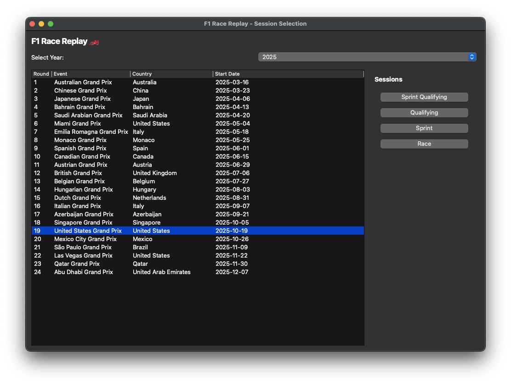

# ApexAI 🏎️ 🏁

> **⚠️ Work in Progress (WIP)** — This project is actively being modified and developed. Features may change and documentation may be incomplete.

A Python application for visualizing Formula 1 race telemetry and replaying race events with interactive controls and a graphical interface. ApexAI is a modified fork of [F1 Race Replay](https://github.com/IAmTomShaw/f1-race-replay).


> **HUGE NEWS:** The telemetry stream feature is now in a usable state. See the [telemetry demo documentation](./telemetry.md) for access instructions, data format details, and usage ideas.

## Features

- **Race Replay Visualization:** Watch the race unfold with real-time driver positions on a rendered track.
- **Insights Menu:** Floating menu for quick access to telemetry analysis tools (launches automatically with replay).
- **Leaderboard:** See live driver positions and current tyre compounds.
- **Lap & Time Display:** Track the current lap and total race time.
- **Driver Status:** Drivers who retire or go out are marked as "OUT" on the leaderboard.
- **Interactive Controls:** Pause, rewind, fast forward, and adjust playback speed using on-screen buttons or keyboard shortcuts.
- **Legend:** On-screen legend explains all controls.
- **Driver Telemetry Insights:** View speed, gear, DRS status, and current lap for selected drivers when selected on the leaderboard.

## Controls

- **Pause/Resume:** SPACE or Pause button
- **Rewind/Fast Forward:** ← / → or Rewind/Fast Forward buttons
- **Playback Speed:** ↑ / ↓ or Speed button (cycles through 0.5x, 1x, 2x, 4x)
- **Set Speed Directly:** Keys 1–4
- **Restart**: **R** to restart replay
- **Toggle DRS Zone**: **D** to hide/show DRS Zone
- **Toggle Progress Bar**: **B** to hide/show progress bar
- **Toggle Driver Names**: **L** to hide/show driver names on track
- **Select driver/drivers**: Click to select driver or shift click to select multiple drivers


## Qualifying Session Support (in development)

Recently added support for Qualifying session replays with telemetry visualization including speed, gear, throttle, and brake over the lap distance. This feature is still being refined.

## Requirements

- Python 3.11+
- [FastF1](https://github.com/theOehrly/Fast-F1)
- [Arcade](https://api.arcade.academy/en/latest/)
- numpy

Install dependencies:
```bash
pip install -r requirements.txt
```

FastF1 cache folder will be created automatically on first run. If it is not created, you can manually create a folder named `.fastf1-cache` in the project root.

## Environment Setup

To get started with this project locally, you can follow these steps:

1. **Clone the Repository:**
   ```bash
   git clone https://github.com/HardCoreGamer969/Apex-AI
   cd Apex-AI
   ```
2. **Create a Virtual Environment:**
    This process differs based on your operating system.
    - On macOS/Linux:
      ```bash
      python3 -m venv venv
      source venv/bin/activate
      ```
    - On Windows:
      ```bash
      python -m venv venv
      .\venv\Scripts\activate
      ```
3. **Install Dependencies:**
    ```bash
    pip install -r requirements.txt
    ```

4. **Run the Application:**
    You can now run the application using the instructions in the Usage section below.

## Usage

**DEFAULT GUI MENU:** To use the new GUI menu system, you can simply run:
```bash
python main.py
```



This will open a graphical interface where you can select the year and round of the race weekend you want to replay. This is still a new feature, so please report any issues you encounter.

**OPTIONAL CLI MENU:** To use the CLI menu system, you can simply run:
```bash
python main.py --cli
```


This will prompt you with series of questions and a list of options to make your choice from using the arrow keys and enter key.

If you would already know the year and round number of the session you would like to watch, you run the commands directly as follows:

Run the main script and specify the year and round:
```bash
python main.py --viewer --year 2025 --round 12
```

To run without HUD:
```bash
python main.py --viewer --year 2025 --round 12 --no-hud
```

To run a Sprint session (if the event has one), add `--sprint`:
```bash
python main.py --viewer --year 2025 --round 12 --sprint
```

The application will load a pre-computed telemetry dataset if you have run it before for the same event. To force re-computation of telemetry data, use the `--refresh-data` flag:
```bash
python main.py --viewer --year 2025 --round 12 --refresh-data
```

### Qualifying Session Replay

To run a Qualifying session replay, use the `--qualifying` flag:
```bash
python main.py --viewer --year 2025 --round 12 --qualifying
```

To run a Sprint Qualifying session (if the event has one), add `--sprint`:
```bash
python main.py --viewer --year 2025 --round 12 --qualifying --sprint
```

## File Structure

```
ApexAI/
├── main.py                    # Entry point, handles session loading and starts the replay
├── requirements.txt           # Python dependencies
├── README.md                  # Project documentation
├── roadmap.md                 # Planned features and project vision
├── resources/
│   └── preview.png           # Race replay preview image
├── src/
│   ├── f1_data.py            # Telemetry loading, processing, and frame generation
│   ├── arcade_replay.py      # Visualization and UI logic
│   └── ui_components.py      # UI components like buttons and leaderboard
│   ├── interfaces/
│   │   └── qualifying.py     # Qualifying session interface and telemetry visualization
│   │   └── race_replay.py    # Race replay interface and telemetry visualization
│   └── lib/
│       └── tyres.py          # Type definitions for telemetry data structures
│       └── time.py           # Time formatting utilities
└── .fastf1-cache/            # FastF1 cache folder (created automatically upon first run)
└── computed_data/            # Computed telemetry data (created automatically upon first run)
```

## Building Custom Telemetry Windows

When you start a race replay, an **Insights Menu** automatically appears, providing quick access to various telemetry analysis tools. You can easily create custom insight windows that receive live telemetry data using the `PitWallWindow` base class:

```python
from src.gui.pit_wall_window import PitWallWindow

class MyInsightWindow(PitWallWindow):
    def setup_ui(self):
        # Create your custom UI
        pass
    
    def on_telemetry_data(self, data):
        # Process telemetry data
        pass
```

The `PitWallWindow` base class handles all telemetry stream connection logic automatically, allowing you to focus solely on your window's functionality.

**Key Features:**
- Automatic connection to telemetry stream
- Built-in status bar with connection state
- Proper cleanup on window close
- Simple API - just implement `setup_ui()` and `on_telemetry_data()`

**Documentation & Examples:**
- See [docs/PitWallWindow.md](./docs/PitWallWindow.md) for complete guide
- See [docs/InsightsMenu.md](./docs/InsightsMenu.md) for adding insights to the menu
- Run the example: `python -m src.gui.example_pit_wall_window`
- Test the menu: `python -m src.gui.insights_menu`

## Customization

- Change track width, colors, and UI layout in `src/arcade_replay.py`.
- Adjust telemetry processing in `src/f1_data.py`.
- Create custom telemetry windows using `PitWallWindow` base class (see above).

## Contributing

There have been several contributions from the community that have helped enhance this project. I have added a [contributors.md](./contributors.md) file to acknowledge those who have contributed features and improvements.

If you would like to contribute, feel free to:

- Open pull requests for UI improvements or new features.
- Report issues on GitHub.

Please see [roadmap.md](./roadmap.md) for planned features and project vision.

# Known Issues

- The leaderboard appears to be inaccurate for the first few corners of the race. The leaderboard is also temporarily affected by a driver going in the pits. At the end of the race, the leaderboard is sometimes affected by the drivers' final x,y positions being further ahead than other drivers. These are known issues caused by inaccuracies in the telemetry and are being worked on for future releases. It's likely that these issues will be fixed in stages as improving the leaderboard accuracy is a complex task.

## 📝 License

This project is licensed under the MIT License. See [LICENSE](./LICENSE) for the full text.

### Attribution & Copyright (MIT License Requirement)

ApexAI is a modified fork of **F1 Race Replay**. The following copyright notice and attribution must be preserved:

> **Copyright (c) Tom Shaw**  
> Original project: [F1 Race Replay](https://github.com/IAmTomShaw/f1-race-replay) by [Tom Shaw](https://tomshaw.dev)

This software is provided under the MIT License. The above copyright notice and this permission notice shall be included in all copies or substantial portions of the Software.

## ⚠️ Disclaimer

No copyright infringement intended. Formula 1 and related trademarks are the property of their respective owners. All data used is sourced from publicly available APIs and is used for educational and non-commercial purposes only.

---

**ApexAI** — A modified fork of [F1 Race Replay](https://github.com/IAmTomShaw/f1-race-replay) by [Tom Shaw](https://tomshaw.dev)
