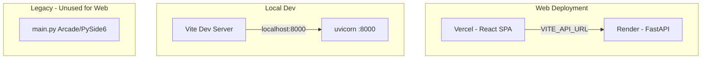
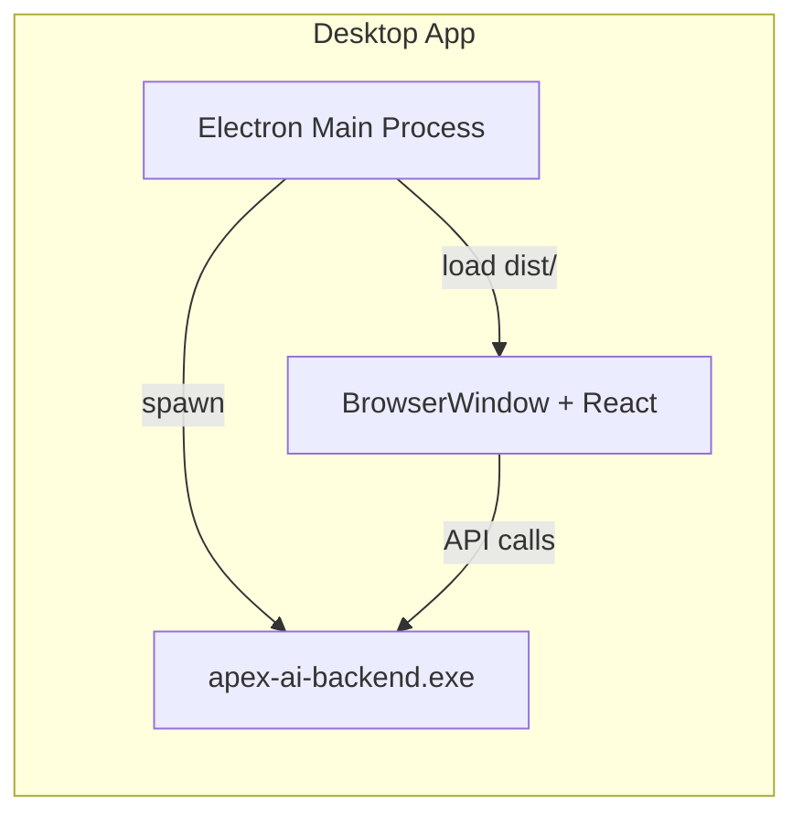
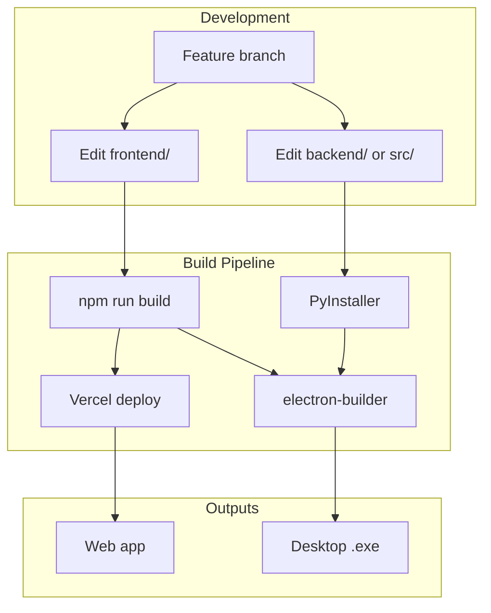

# Desktop EXE and Unified Feature Pipeline

This document describes the plan to add a Windows .exe desktop build and establish a shared development pipeline so features apply to both web and desktop deployments.

---

## Current Architecture



The web app uses React (Vercel) + FastAPI (Render). The frontend connects via `VITE_API_URL` ([frontend/src/api/client.ts](../frontend/src/api/client.ts)). There is no desktop packaging today.

---

## Part 1: Desktop .exe Architecture

### Approach: Electron + PyInstaller (Two-Process Model)

| Component         | Technology                | Rationale                                                                  |
| ----------------- | ------------------------- | -------------------------------------------------------------------------- |
| **Desktop shell** | Electron                  | Mature, well-documented; spawns subprocesses easily; same React app as web |
| **Frontend**      | Existing React/Vite build | Reuse `frontend/dist`; no code changes                                     |
| **Backend**       | PyInstaller               | Bundle FastAPI + uvicorn + FastF1 as a separate .exe; Electron spawns it   |

**Flow:**

1. User runs `ApexAI.exe` (Electron)
2. Electron spawns `apex-ai-backend.exe` (PyInstaller) on a random free port (e.g. 8765)
3. Electron loads `dist/index.html` in a BrowserWindow with `VITE_API_URL=http://localhost:8765`
4. On quit, Electron kills the backend process



### Alternative: Tauri (Lighter)

Tauri (Rust + webview) yields a smaller binary (~10MB vs ~150MB) but requires Rust toolchain and more setup for subprocess management. Recommended as a Phase 2 if bundle size becomes an issue.

---

## Part 2: Implementation Structure

### New Directories and Files

```
ApexAI/
├── desktop/                    # NEW: Electron app
│   ├── package.json
│   ├── electron-builder.json   # Build config for .exe
│   ├── main.js                 # Electron main: spawn backend, create window
│   └── preload.js              # Optional: secure bridge if needed
├── desktop-backend/            # NEW: PyInstaller entry + spec
│   ├── main.py                 # Wrapper: freeze_support + uvicorn.run(app)
│   └── apex-ai-backend.spec    # PyInstaller spec (excludes, data, etc.)
├── frontend/                   # UNCHANGED - shared source
├── backend/                    # UNCHANGED - shared source
└── scripts/
    └── build-desktop.ps1       # Orchestrates: frontend build, backend freeze, electron pack
```

### Key Implementation Details

1. **Backend wrapper** (`desktop-backend/main.py`):
   - Import `backend.main:app` directly
   - Use `freeze_support()` and `uvicorn.run(app, host="127.0.0.1", port=0)` (port 0 = random free port)
   - Write chosen port to a temp file; Electron reads it and sets env for the renderer
   - Avoid `--onefile` for uvicorn (known issues); use `--onedir` and bundle the folder

2. **Electron main** (`desktop/main.js`):
   - Resolve path to `apex-ai-backend.exe` (next to app in packaged build)
   - `child_process.spawn(backendExe)` with `stdio: 'pipe'`
   - Poll/wait for port file or health endpoint
   - Create `BrowserWindow` with `loadFile('dist/index.html')` and `webPreferences.webSecurity: true`
   - Inject `VITE_API_URL` via `process.env` or a build-time replace in `index.html`

3. **Frontend API URL for desktop**:
   - Option A: Build frontend with `VITE_API_URL=http://localhost:PLACEHOLDER` and replace `PLACEHOLDER` at runtime via Electron's `webPreferences.preload` script that exposes the actual port
   - Option B: Use a fixed port (e.g. 8765) for desktop builds; simpler but risk of conflict

4. **Static files**:
   - Electron serves from `dist/` (built by Vite). The backend does *not* serve the frontend in desktop mode.

---

## Part 3: Unified Feature Pipeline

### Principle: Single Source of Truth

| Layer        | Source                      | Web          | Desktop                   |
| ------------ | --------------------------- | ------------ | ------------------------- |
| Frontend     | `frontend/src/`             | Vercel build | Same Vite build → `dist/` |
| Backend      | `backend/` + `src/`         | Render       | PyInstaller bundle        |
| API contract | `frontend/src/types/api.ts` | Shared       | Shared                    |

### Development Workflow



### Pipeline Rules

1. **All features go through the same code paths** — no `if (isDesktop)` branches unless necessary (e.g. auto-updater, native menus).
2. **Environment-based config** — `VITE_API_URL` is set at build time for web (Vercel env) and at runtime for desktop (Electron injects).
3. **CI/CD** — Add a GitHub Actions workflow that:
   - On release/tag: build frontend, build PyInstaller backend, run electron-builder
   - Produce `ApexAI-Setup-1.2.3.exe` (or similar) as a release asset
4. **Documentation** — Update README with "Desktop Build" and "Pipeline" sections.

---

## Part 4: CI/CD Workflow

### New Workflow: `.github/workflows/desktop-build.yml`

```yaml
# Triggers: release, manual, or push to main (optional)
jobs:
  build-desktop:
    runs-on: windows-latest
    steps:
      - checkout
      - Setup Node, Python, uv
      - npm ci (frontend)
      - uv sync
      - npm run build (frontend)
      - pip install pyinstaller
      - pyinstaller desktop-backend/apex-ai-backend.spec
      - cd desktop && npm ci && npx electron-builder --win
      - Upload ApexAI-*.exe to release artifacts
```

**Note:** PyInstaller on Windows will produce a large bundle (~200–400MB) due to FastF1, matplotlib, numpy, pandas. Consider documenting this and optionally offering a "portable" zip of the `dist/` folder for advanced users.

---

## Part 5: Feature Parity Checklist

When adding a feature, ensure:

1. **Frontend** — Works in both browser and Electron webview (no `window.open` to external URLs without user intent; use `shell.openExternal` in Electron for links).
2. **Backend** — No Render-specific env (e.g. `RENDER`) required for core logic; use feature flags or optional env.
3. **API** — Same endpoints, same request/response shapes for web and desktop.
4. **Docs** — If the feature affects setup, update both "Quick Start" (web) and "Desktop Build" sections.

---

## Part 6: Implementation Order

| Phase | Task                                                                             | Effort |
| ----- | -------------------------------------------------------------------------------- | ------ |
| 1     | Create `desktop-backend/main.py` + PyInstaller spec                              | Small  |
| 2     | Create `desktop/` Electron app (main.js, package.json, electron-builder)         | Medium |
| 3     | Wire port discovery (backend writes port, Electron reads, injects into frontend) | Small  |
| 4     | Local build script (`scripts/build-desktop.ps1` or `.sh`)                        | Small  |
| 5     | GitHub Actions workflow for Windows build                                        | Medium |
| 6     | README + docs update                                                             | Small  |

---

## Open Decisions

1. **Port strategy**: Fixed (e.g. 8765) vs dynamic (backend picks, Electron reads). Dynamic is more robust.
2. **Backend visibility**: Hide console window for backend on Windows (`subprocess.CREATE_NO_WINDOW`) vs show for debugging. Recommend hidden by default, flag for debug.
3. **Updates**: No auto-updater in Phase 1; users re-download. Phase 2 could add electron-updater.
