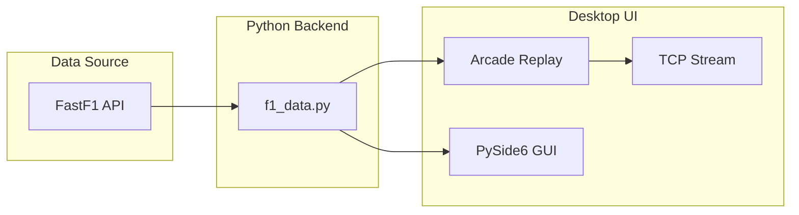
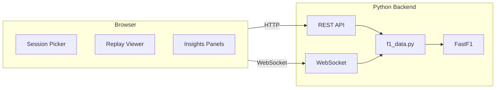

# ApexAI Full-Stack Web App Plan

**Status:** Draft / WIP

This document outlines how to transform ApexAI from a desktop application into a full-stack web app, retaining Python for the FastF1 API and proposing alternative tech stacks for the web layer.

---

## Current Architecture

### Overview

ApexAI is currently a desktop application built with:

- **Python / FastF1 (must stay):** All session and telemetry logic lives in [src/f1_data.py](../src/f1_data.py): `load_session()`, `get_race_telemetry()`, `get_quali_telemetry()`, event schedule helpers, and `.fastf1-cache` / `computed_data/` pickle cache. Heavy work uses multiprocessing and produces frame lists at 25 FPS.
- **Desktop UI (to replace):** [src/interfaces/race_replay.py](../src/interfaces/race_replay.py) (Arcade) for track + HUD; [src/gui/race_selection.py](../src/gui/race_selection.py) (PySide6) for session selection; [src/services/stream.py](../src/services/stream.py) (TCP socket) for telemetry broadcast.
- **Data shape:** Frames are already JSON-serializable (see [telemetry.md](../telemetry.md)): per-frame driver positions (x, y, speed, gear, DRS, etc.), lap, time, weather, track status. Track geometry comes from `build_track_from_example_lap()` in [src/ui_components.py](../src/ui_components.py) (centerline, width, DRS zones).

### Current State Diagram

---

## Target Web Architecture

### Overview

- **Backend (Python):** REST API for session list, session metadata, and "get replay data" (precomputed frames + track geometry). Optional: WebSocket endpoint that pushes frames at 25 FPS for live playback, or client fetches frame range and plays locally.
- **Frontend (web):** Session picker (year/round/session type), replay viewer (track + leaderboard + controls), and optional "insights" panels. Playback can be client-driven (request frames or receive via WebSocket).
- **Real-time:** Replace TCP in [src/services/stream.py](../src/services/stream.py) with WebSockets (or SSE) from the same Python backend.

### Target Architecture Diagram

---

## Tech Stack Options

### Backend (Python – required for FastF1)

| Option | Pros | Cons |
|--------|------|------|
| **FastAPI** | Async, native WebSocket support, OpenAPI, good for high-frequency frame streaming | Newer ecosystem |
| **Flask** | Simple, large ecosystem; add Flask-SocketIO for WebSockets | More manual setup for async/WebSocket |
| **Django + Django Ninja or DRF** | Admin, ORM, structure; WebSockets via Django Channels | Heavier; more boilerplate for API-only use |

### Frontend

| Option | Pros | Cons |
|--------|------|------|
| **React** | Large ecosystem, many chart/visualization libs; pair with Vite or Next.js | Verbose; larger bundle |
| **Vue 3** | Simpler learning curve, good for dashboards; Vite or Nuxt | Smaller ecosystem than React |
| **Svelte / SvelteKit** | Small bundle, good performance for canvas-heavy UIs | Smaller ecosystem |
| **Next.js** | SSR/SSG + API routes; can proxy to Python backend | May add complexity if Python is primary API |

### Track / Replay Rendering (replace Arcade)

| Option | Pros | Cons |
|--------|------|------|
| **Canvas 2D** | Simple track outline and car markers; sufficient for current-style replay | Manual coordinate handling |
| **PixiJS** | 2D WebGL, sprites, good for many moving objects | Additional dependency |
| **Three.js** | 3D tracks or camera angles for future | Overkill for 2D replay |

### Real-time

| Option | Pros | Cons |
|--------|------|------|
| **FastAPI WebSockets** | One process: API + WebSocket in same app | N/A |
| **Socket.IO** | Mature protocol; Flask-SocketIO or Node adapter | Extra protocol layer |

### Data / Cache

- Keep `computed_data/` (or move to shared volume) for precomputed telemetry
- Optional Redis for job queue or caching session list

### Hosting

| Layer | Options |
|-------|---------|
| Backend | Railway, Render, Fly.io, VPS (Docker) |
| Frontend | Vercel, Netlify, or same host as backend (FastAPI serving SPA) |
| Note | Python + FastF1: Ensure enough CPU/memory for first-time session load; consider background precomputation |

---

## Recommended Default Stack

For a practical, actionable path:

- **Backend:** FastAPI (Python 3.11+), reuse [src/f1_data.py](../src/f1_data.py) and existing cache; add REST endpoints + WebSocket for frame stream.
- **Frontend:** React + Vite (or SvelteKit), Canvas 2D or PixiJS for track replay.
- **Real-time:** FastAPI WebSocket replacing the current TCP telemetry stream.

### Alternatives

- **Flask + Vue** – Simpler backend, simpler frontend.
- **Django + Svelte** – Full admin, structured backend, lightweight frontend.
- **Next.js + FastAPI** – Next.js for frontend + API routes that proxy to Python; FastAPI as backend service.

---

## Migration Phases

### Phase 1 – API

Add a FastAPI app (or chosen backend) next to existing code; expose:

- Session list (year, round, session type)
- Load session + get frames + track geometry

Reuse `get_race_telemetry`, `build_track_from_example_lap`-derived data. No removal of Arcade/PySide6 yet.

### Phase 2 – Web Client

Implement session picker and replay page; fetch session list and replay data from API; render track and playback in browser (Canvas/PixiJS).

### Phase 3 – Real-time

Add WebSocket endpoint that streams frames (or frame indices + data) from backend; optionally keep "fetch full replay" for offline-style playback.

### Phase 4 – Parity & Cutover

Add qualifying flow, insights-style panels, and settings; deprecate or remove desktop-only UI and TCP stream.

---

## Reference Links

- [telemetry.md](../telemetry.md) – Telemetry data format and stream format
- [src/f1_data.py](../src/f1_data.py) – Core FastF1 integration
- [src/services/stream.py](../src/services/stream.py) – Current TCP telemetry stream
- [src/ui_components.py](../src/ui_components.py) – Track geometry (`build_track_from_example_lap`)
